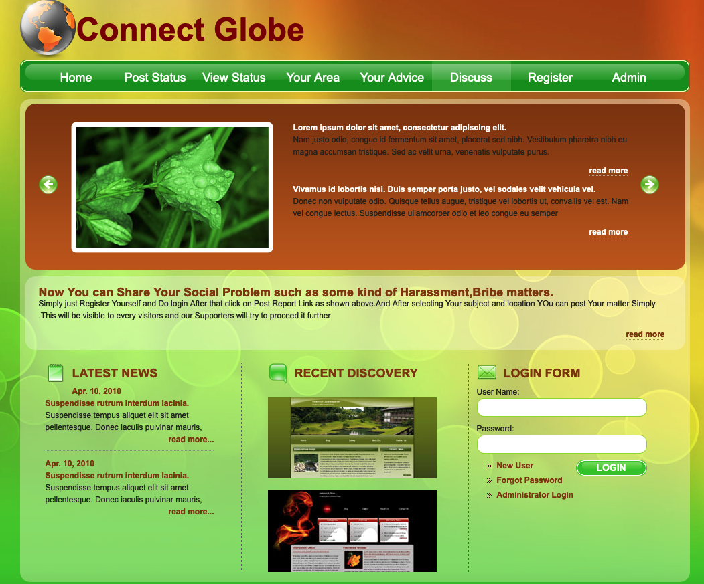

# Project Title:

Blog and Report Abuse Web Application 

## 1. Project Description

This is a Blog and Report Abuse Web Application built using Java technologies.

The application will comprise of two users and accompaning capabilities.

- Administrator:
1. Login (Username / Password: admin, admin)
2. View Registered Users 
3. View Users Discussion
4. View Users Advice
5. View Reports By Area
6. View Report Status
7. View Posted Reports
8. Log out

- Users:
1. Register / Login 
2. View Registered Users 
3. View Users Discussion
4. View Users Advice
5. View Reports By Area
6. View Report Status
7. View Posted Reports
8. Log out

## 2. Tech Stack:

- HTML / CSS / JavaScript
- Bootstrap
- Java 11
- JavaEE 7
- Java JSP / Servlet
- Java JDBC Driver
- MySQL Database 

## 3. Installing:

i. Clone the git repo

```
https://github.com/AAdewunmi/Java-Blog-Web-Application.git
```

ii. Open project folder

iii. Explore

## 4. How To Use

i. Create Database -> JavaBlogDB

ii. Create tables -> web/sql/sql_create_table.txt

iii. Open project in preferred IDE (I used Netbeans) 

iv. Run index.jsp -> web/index.jsp

v. advice.jsp: File not included in project from original author (Engineering.Org.In)

vi. MyListener.java: File required to use this abstract class not included in project from original author (Engineering.Org.In).
So I created the database and sql tables manually and included script (sql_create_table.txt) in project.

Have fun

😎

## 5. Demo



## 6. Adapted from: 

UDEMY: Java Development Mega Course: Build Projects Practically

(Java Programming Course: Learn Development of JAVA Projects Using JSP, JDBC, Servlets, Swing, Spring Boot, Maven, Hibernate)

Project Name: Project 40: Blog and Report System

Created by: Engineering.Org.In

Last updated: 09/2022

URL: https://www.udemy.com/course/build-real-world-java-projects-using-spring-jsp-jdbc/
